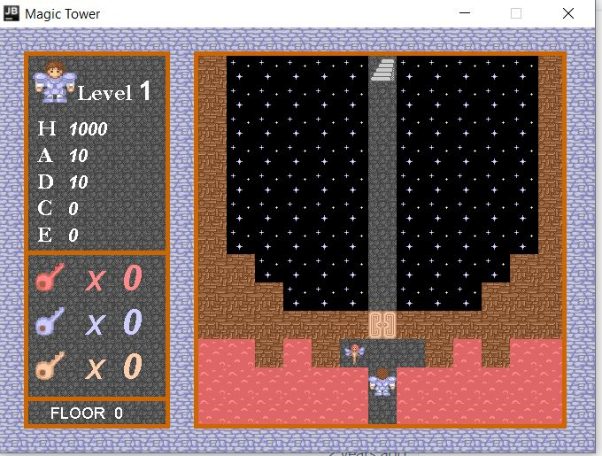
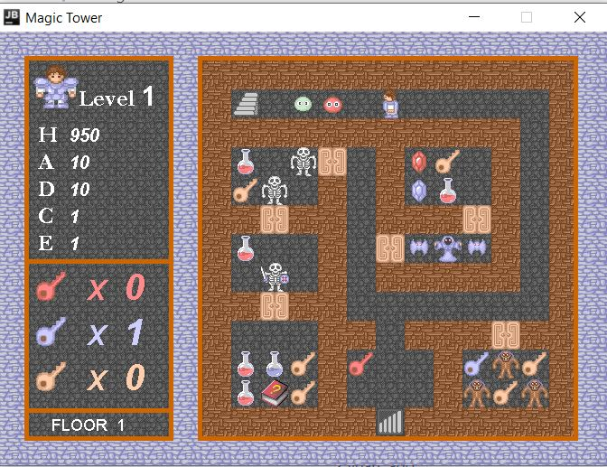
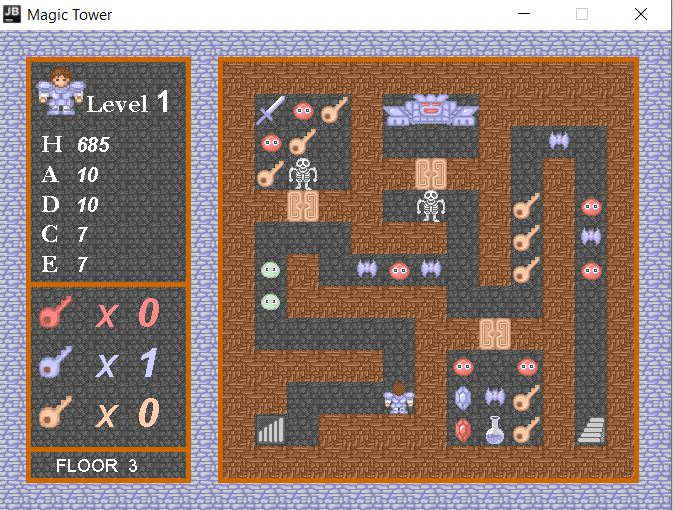

# Motivation

I'm creating this game during the winter after my first semester of university was over. I chose to recreate this game called "Magic Tower", a dungeon-and-dragon style of game that I spent plenty of time when I was kid. To build this game, I decided to opt out of any type of game engine for reason that the game play was relatively simple, no fancy animations, particle effects, or complex collision detections. Javax and Java AWT are good enough to build the game.

In this game, you will have to climb the spire, and along the way, defeat over 50 kinds of monsters, collect various items, and upgrade your skills in the market, all for preparing yourself up for the ultimate confrontation with the invincible devil king. You need to be smart and devise strategies to kill the monsters.

For design, I maintained a main game loop at 30 FPS. Each loop polls for the keyboard and sound events, process them which updates the image buffer, and draws the image buffer to my screen.

Since I'm writing this game for purpose of practicing coding and not aim to create an actual product, I'll leave the combat statistics untuned, so the gameplay can be not balanced. I'll cut off some dialogues in the last few floors too and leave it to the future, just to get back some time for preparation of the next semester and enjoying the last few days of winter vacation.

## Development

To compile the source code: `javac -d bin src/*/*.java`.
To start the game: `java -cp bin/ main.GameFrame`

## Examples

**Floor 0**

**Floor 1**

**Floor 3**

